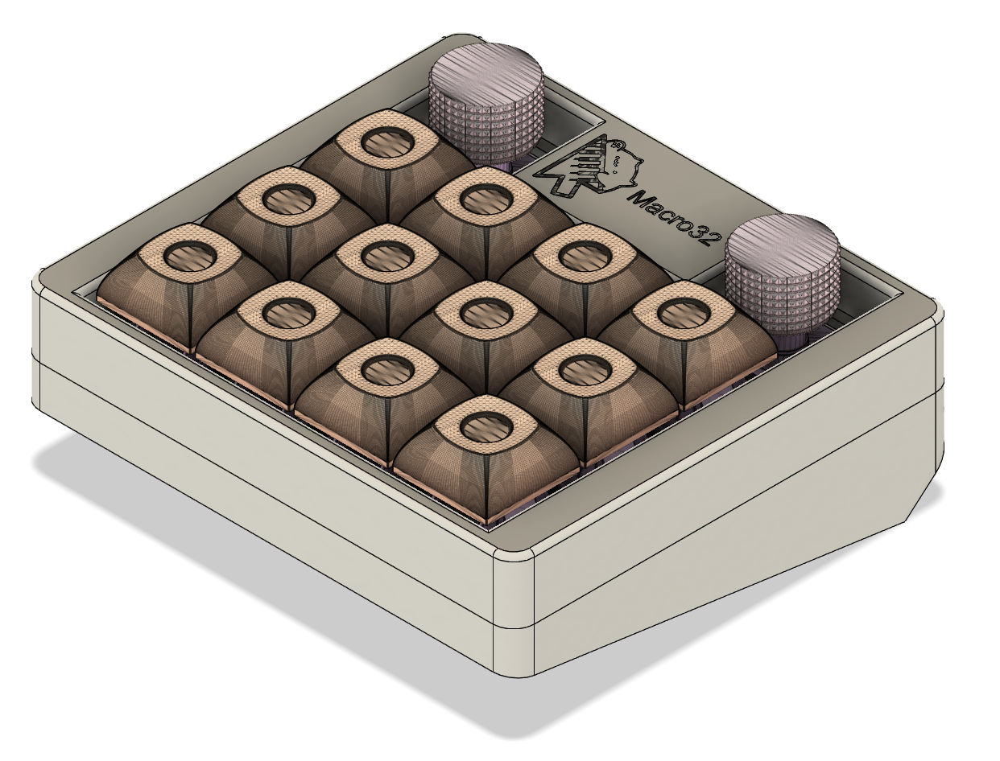

# Build Guide

This is the build guide for the Macro32

## Parts

### PCB components - Required

| Name                        | Count    | Remarks                               |
|:----------------------------|:---------|:--------------------------------------|
| Ceramic capacitor 4.7uF     | 1        | 4.7uF with 0805 footprint             |
| Ceramic capacitor 1uF       | 3        | 1uF with 0805 footprint               |
| Ceramic capacitor 100nF     | 7        | 100nF with 0805 footprint             |
| Diode SOD-123               | 14       |                                       |
| Fuse 500mA                  | 1        | Optional but reccomended              |
| USB-C port                  | 1        | USB4110                               |
| Resistor 10k                | 1        | 0805 footprint                        |
| Resistor 5.1k               | 2        | 0805 footprint                        |
| MX hotswap socket           | 12 - 14  | depending if you want rotary encoders |
| tiny switch                 | 2        | SW_SPST_TS-1088-xR020                 |
| STM32F072                   | 1        | LQFP48 format                         |
| voltage regulator           | 1        | XC6206PxxxMR SOT-23-3 footprint       |
| --------------------------- | -------- | ------------------------------------  |
| ec12 rotary encoder         | 0 - 2    |                                       |
| LED                         | 4        | WS2812B for underglow                 |
| LED Line driver             | 1        | 74AHC1G125 SOT-353 footprint          |
| Resistor 100k               | 1        | 0805 footprint (for LED)              |

### Special case

!!!! ONLY IN V1
Due to a mistake in the shematic the USB ESD protector was inproperly connected.
This means the USB ESD protection is not needed in V1.

| Name                        | Count    | Remarks                               |
|:----------------------------|:---------|:--------------------------------------|
| USB ESD protection          | 1        | USBLC6-2P6 SOT-666 footprint          |

### Full build components

| Name                    | Count           | Remarks                       |
|:------------------------|:----------------|:------------------------------|
| PCB                     | 1               |                               |
| Case                    | 1               | Top and bottom                |
| Switch plate            | 1               | FR4 1.6mm thick or 3d printed |
| Key switches            | 12 - 14         | Only Cherry MX compatible     |
| Keycaps                 | 12 - 14         | 1u                            |
| Screw M3x8              | 8               | For Case assembly             |
| Type-C cable            | 1               |                               |
| ----------------------- | --------------- | ---------------------------   |
| Rotary Encoder knobs    | 0 - 2 pieces    |                               |

## Firmware preparation

Please see [firmware.md](./firmware.md).

## Build

I'll be starting the guide from an unpopulated PCB
If you let jlcpcb or similar populate the PCB for you then skip to part !TODO
<!-- TODO -->

### 1. Make sure you have all the components to populate the PCB

Components can be found in the [BOM](https://raw.githubusercontent.com/KillrOfLife/Macro32/refs/heads/main/PCB/production/bom.csv) or above in the components list.

You can make the choice between having 14 switches and no rotary encoders or 12 switches with rotary encoders.
The rotary encoders are wired as such that you can place encoders with a built in switch.

!!!! ONLY IN V1
Due to a mistake in the shematic the USB ESD protector was inproperly connected.
This means the USB ESD protection is not needed in V1.

### 2. Place Components

1. In case you have a stencil, use it with some solder paste to apply solder paste on the pads of the bottom of the PCB.
This makes assembly easier than soldering all the small components by hand.

2. Place the components on the board
I recommend placing small components, the USB-C header and the microcontroller in this step
3. use a heat gun or heatplate to melt the solder.
4. Place your Cherry MX hostwap sockets on the board and give them a little touch with your soldering iron.
5. now you can insert your rotary encoders on the FRONT SIDE OF THE BOARD and solder the connectors on the back.
6. Your PCB should now look something like this

    

    Theres one more step to go, manually fix my mistake and solder a few pads with some wire

7. connect the pads of U2 (the ESD protector) to make sure the USB data can pass to the microcontroller (follow the yellow to connect the pads)

    

Your PCB should now be working!
go ahead and flash some firmware [firmware.md](./firmware.md).

### 3. Assemble
<!-- more images incoming for assembly process -->

1. Attach the switches to the switch plate.

2. Add the PCB to the bottom of the switches.

3. Screw the switch plate to the top of the chassis.

4. Add the bottom of the chassis.

5. Screw the bottom to the top of the chassis.

6. Optional add some rubber feet

7. Go ahead and jazz it up with some colorful keycaps.
